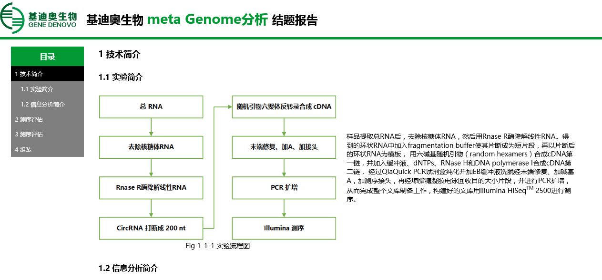
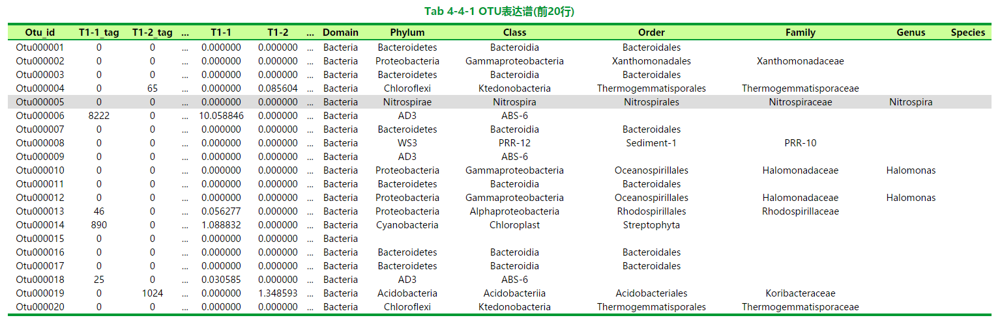
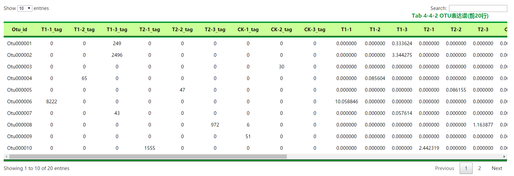

@(工作记录)


[TOC]

GDHR（GeneDenovo HTML Report）模块使用手册
---

### 声明

**GDHR** 是用来生成HTML结题报告的一个模块，模块以现有的结题报告为模板，自定义了一些模块化的函数，方便快速的生成结题报告并打包压缩。

反馈邮箱：<pai@genedenovo.com>

### 版本
目前版本为 `GDHR v1.2.5`。

### 更新说明

#### v1.2
1. 修复了使用手册中**imgs2html2**函数使用方法中的书写错误，将**imgs2html**改成**imgs2html2**。
2. 修复了desc函数的结果没有添加到html中的bug。

#### v1.2.1
1. 给函数desc添加了参数`-pre`

#### v1.2.2
1. 给函数tsv2html添加了参数'`-omits'`

#### v1.2.3
1. 给函数tsv2html添加了参数`-class`和`-width`

#### v1.2.4
1. 给函数img2html2添加了参数`-space`

#### v1.2.5
1. 移除了自动在section最后添加分隔段（基迪奥logo+分割线那部分）
2. 添加了强制分页功能，在转pdf的时候可以强制分页，且每个分页会有个页眉（跟以前的分隔段一样）
3. 给函数section添加了`-break`和`-page_head`参数
4. GDHR::HTML模块添加了新函数`break`

### 使用需求

1. Perl 5.x
2. 设置环境变量`GDHR_PATH`, 例如：`export GDHR_PATH=/Bio/User/aipeng/bin/report`

### 使用示例

```perl
# 导入模块
use lib "$ENV{GDHR_PATH}/lib";
use GDHR;

# 初始化报告
my $outdir = "test";
my $report = GDHR->new('-outdir'=>$outdir,-pipe=>"meta Genome");

# 创建块（含页眉）
my $section = $report->section(id=>"introduction",page_head=>1);

# 添加菜单和子菜单（目前仅支持两级菜单）
$section->menu("技术简介");
$section->submenu("实验简介");

...

# 强制分页
$section->break; 

# 添加图片
$section->img2html(-file=>"image/flow_001.png",-name=>"实验流程图",-desc=>$flow1_desc);

...

# 输出结题报告目录
$report->write();

# 打包和压缩结题报告目录
$report->pack(-format=>"zip");

__END__
```

更详细的实例可参见脚本文件**`$ENV{GDHR_PATH}/GDHR.pl`**

**结题报告输出效果截图**


**页眉效果截图**


点击logo可以返回顶端，点击右侧公司名称可以跳转到公司官网。


### 模块GDHR

#### new()

> **使用方法**
> `my$report = GDHR->new(-outdir=>"test",-pipe=>"Meta Genome",-name=>"index")`
> 
> **功能**
> 创建并初始化一个结题报告。初始化结题报告包括将结题报告配置文件等拷贝到`-outdir`目录，创建结题报告html文               件等。
> 
>**返回值**
> 返回一个GDHR对象
> 
> **参数**
> + **-outdir：** 结题报告的输出目录，目录里面应包含所有的分析结果，不可缺省。
> + **-pipe：** 结题报告的名称，将呈现在结题报告的html文件中，缺省为“**补充分析**”,务必要设置对。
> + **-name：** 结题报告html主文件的名称，默认为index，即`index.html`文件。

#### section()
> **使用方法**
> `my$section = $report->section()`
> 
> **功能**
>在结题报告中创建一个模块(即一个分析模块)，即html文件中的section。
> 
>**返回值**
> 返回一个`GDHR::HTML`对象
> 
> **参数**
> + **id**：该section在html中的id
> + **-split**：在该section前面进行强制分页（另起一页输出该section），且在新一页的开始添加页眉。
> + **-page_head**：在该section前面添加页眉。

#### write()
> **使用方法**
> `$report->write()`
> 
> **功能**
>输出结题报告html文件。
> 
>**返回值**
> 无
> 
> **参数**
> 无

#### pack()
> **使用方法**
> `$report->pack(-format=>"bz2")`
> 
> **功能**
>打包分析结果和结题报告文件，并进行压缩。
> 
>**返回值**
> 无
> 
> **参数**
> + **-format：** 设置打包压缩格式，目前支持`bz2, gz, zip, rar`。其中`bz2`和`gz`需要先用tar进行打包，默认值为`bz2`。

### 模块GDHR::HTML

#### new()
> **使用方法**
> `my$element = GDHR::HTML->new(-tag=>"div",-class=>"normal_cont")`
> 
> **功能**
>创建一个新的html标签。（**如果对html不熟悉，尽量避免使用该函数。**）
> 
>**返回值**
> 返回一个`GDHR::HTM`对象
> 
> **参数**
> + **-tag:** html标签名，默认值为`div`。
> + **-class:** html标签的class属性值，默认为`normal_cont`。

#### section()
> **使用方法**
> `my$section = GDHR::HTML->section(-class=>"normal_cont")`
> 
> **功能**
>创建一个新的html的section标签，对应即结题报告中的一个模块，GDHR中的section即调用该函数。等同于
>`my$section = GDHR::HTML->new(-tag=>"section",-class=>"normal_cont")`
> 
>**返回值**
> 返回一个`GDHR::HTM`对象
> 
> **参数**
> + **-class:** html标签的class属性值，默认为`normal_cont`。
>  
> **注意**
> 该函数目前在每个section的结尾都添加了分割页脚，这是与`new()`不同的地方，后面的版本会添加一个参数选择是否添加。

#### menu()
> **使用方法**
> `$section->menu($title,-help=>$anchor,%opts)`
>  
> **功能**
>给section添加一个主菜单，即html中的`<h3>`标签。
> 
>**返回值**
> 无
> 
> **参数**
> + **-help：** 为该标签添加一个帮助说明链接[^help]。
> + **%opts：** 为该标签添加属性[^opts]。

#### submenu()
> **使用方法**
> `$section->submenu($subtitle,-help=>$anchor,%opts)`
>  
> **功能**
>给section添加一个子菜单，即html中的`<h4>`标签。
> 
>**返回值**
> 无
> 
> **参数**
> + **-help：** 为该标签添加一个帮助说明链接[^help]。
> + **%opts：** 为该标签添加属性[^opts]。

#### desc()
> **使用方法**
> `$section->desc($str,-help=>$anchor,%opts)`
>  
> **功能**
>给section添加一段文字描述，即html中的`<p>`标签。
> 
>**返回值**
> 无
> 
> **参数**
> + **-help：** 为该标签添加一个帮助说明链接[^help]。
> + **-pre：**将文本嵌入`<pre>`标签中，保留原先的文本格式呈现在html中。
> + **%opts：** 为该标签添加属性[^opts]。

#### files2list()
> **使用方法**
> `$section->files2list(-files=>\@files,-desc=>\@desc,%opts)`
>  
> **功能**
>生成一个文件列表及其说明，对应html中的`<ul>和<li>`标签。
> 
>**返回值**
> 无
> 
> **参数**
> + **-files：**文件路径的数组指针，**不可缺省**。
> + **-desc：** 对应文件的描述信息数组指针，**不可缺省**，且数组的长度与`-files`必须相等。
> + **%opts：** 为该标签添加属性[^opts]。

#### matrix2html()
>**说明**
>暂时不支持，正在开发中
>**功能**
>直接将perl的二维数组转换成html的表格

#### tsv2html()
> **使用方法**
> `$section->tsv2html(-file=>$file,-name=>$name,-top=>10,-header=>1,-max_chars=>20,-help=>$anchor,-omits=>"4:10,20:24")`
>  
> **功能**
>将文本表格文件tsv转换成html中的表格，即`<table>`标签。
> 
>**返回值**
> 无
> 
> **参数**
> + **-file：**输入文本表格文件路径，**不可缺省**。
> + **-name：**表格的名称，**不可缺省**。
> + **-top：**只在html中显示文件的前`-top`行，默认为10。
> + **-header：**输入的表格文件是否含有表头，有1（含有）和0（不含）两种值，默认为1。
> + **-max_chars：**每个表格框中允许呈现的最大字符长度，默认不设上限。
> + **-help：** 为该表格添加一个帮助说明链接[^help]。
> + **-omits** 将特定的列隐藏不显示，替换成”**...**“，防止列数太多导致表格过大。不同的区段用逗号“**,**"隔开，一个区段的起始列和终止列用冒号“**:**”或者连接符“**-**”隔开。
> + **-class** 设置表格的类名，目前支持两种类名**func_table**和**hl_table**，默认为**func_table**。两者的样式见下图。
> + **-width** 设置表格的宽度，默认为“**100%**”，如果**-class**设置为**func_table**的时候最好选择默认值。


图1 `-class => hl_table` 时的表格样式，通常会配合-omits参数使用，无法给表格添加横向的滚动轴，也无筛选等功能。


图2 `-class => func_table` 时的表格样式，可以给表格添加横向的滚动轴，具有分页显示，筛选等功能。

#### img2html()
> **使用方法**
> `$section->img2html(-file=>$file,-name=>$name,-desc=>$desc,-help=>$anchor)`
>  
> **功能**
>将单个图片插入html中，即``标签。
> 
>**返回值**
> 无
> 
> **参数**
> + **-file：**插入图片文件路径，**不可缺省**。
> + **-name：**图片的名称，**不可缺省**。
> + **-desc：**图片的描述说明信息，默认为空。
> + **-help：** 为该图片添加一个帮助说明链接[^help]。

#### img2html2()
> **使用方法**
> `$section->img2html2(-file1=>$file1,-name1=>$name1,-desc1=>$desc1,-file2=>$file2,-name2=>$name2,-desc2=>$desc2,-help=>$anchor)`
>  
> **功能**
>将两个图片并排插入html中。
> 
>**返回值**
> 无
> 
> **参数**
> + **-file1：**左边插入图片文件路径，**不可缺省**。
> + **-name1：**左边插入图片的名称，**不可缺省**。
> + **-desc1：**左边插入图片的描述说明信息，默认为空。
> + **-file2：**右边插入图片文件路径，**不可缺省**。
> + **-name2：**右边插入图片的名称，**不可缺省**。
> + **-desc2：**右边插入图片的描述说明信息，默认为空。
> + **-help1：** 为左边图片添加一个帮助说明链接[^help]。
> + **-help2：** 为右边图片添加一个帮助说明链接[^help]。
> + **-space:** 设置两个图片中间的空隙，0-100（%），默认10。

#### imgs2html()
> **使用方法**
> `$section->imgs2html(-files=>\@files,-names=>\@names,-desc=>\@descs,-name=>$title,-note=>$note,-help=>$anchor)`
>  
> **功能**
>将多个图片作为一个整体（记作img_slides）插入html中，形成类似幻灯片的效果。
> 
>**返回值**
> 无
> 
> **参数**
> + **-files：**插入图片文件路径的数组指针，**不可缺省**。
> + **-names：**插入图片的名称（slide的名称）的数组指针，**不可缺省**，且数组的长度与`-files`必须相等。
> + **-desc：**插入图片的描述说明信息的数组指针，且数组的长度与`-files`必须相等，默认为空。
> + **-name：**整个`img_slides`的名称，缺省为空。
> + **-note：**整个`img_slides`的描述信息，缺省为空。

#### imgs2html2()
> **使用方法**
> `$section->imgs2html2(-files1=>\@files1,-files2=>\@files2,-desc1=>\@descs1,-desc2=>\@descs2,-names=>\@names,-name=>$title,-note=>$note,-help=>$anchor)`
>  
> **功能**
>将两组个图片作为一个整体（记作2img_slides）插入html中，形成类似幻灯片的效果，每张slide含有两张图片。
> 
>**返回值**
> 无
> 
> **参数**
> + **-files1：**左边插入图片文件路径的数组指针，**不可缺省**。
> + **-files2：**右边插入图片文件路径的数组指针，**不可缺省**，且数组的长度与`-files1`必须相等。
> + **-names：**插入图片的名称（slide的名称）的数组指针，**不可缺省**，且数组的长度与`-files1`必须相等。
> + **-desc1：**左边插入图片的描述说明信息的数组指针，且数组的长度与`-files1`必须相等，默认为空。
> + **-desc2：**右边插入图片的描述说明信息的数组指针，且数组的长度与`-files1`必须相等，默认为空。
> + **-name：**整个`2img_slides`的名称，缺省为空。
> + **-note：**整个`2img_slides`的描述信息，缺省为空。

#### break()

> **使用方法**
> `$section->break()`
>
> **功能**
> 在该处进行强制分页，主要是为了避免html在转换成pdf的过程中造成表格或者图片断裂。同时会为新的页面添加页眉。页眉的详细样式见上面的效果图。
> 
> **返回值**
> 无
> 
> **参数**
> 无

#### add_html()
> **使用方法**
> `$section->add_html($html_code)`
>  
> **功能**
>将一段**html**代码插入`GDHR::HTML`对象中。
> 
>**返回值**
> 无
> 
> **参数**
> + **$html_code：**需要插入的html代码，**不可缺省**。

#### innerHTML()
> **使用方法**
> `$section->innerHTML()`
>  
> **功能**
>输出`GDHR::HTML`对象中的html代码。
> 
>**返回值**
> `GDHR::HTML`对象中的html代码。
> 
> **参数**
> 无

[^help]: \$anchor为链接的对象，大多为帮助html文件中的锚，也可以是url链接。

[^opts]: \%opts的键值分别对应属性名和属性值，比如class，style等（**如果对html的属性不熟悉，尽量避免使用。**）

